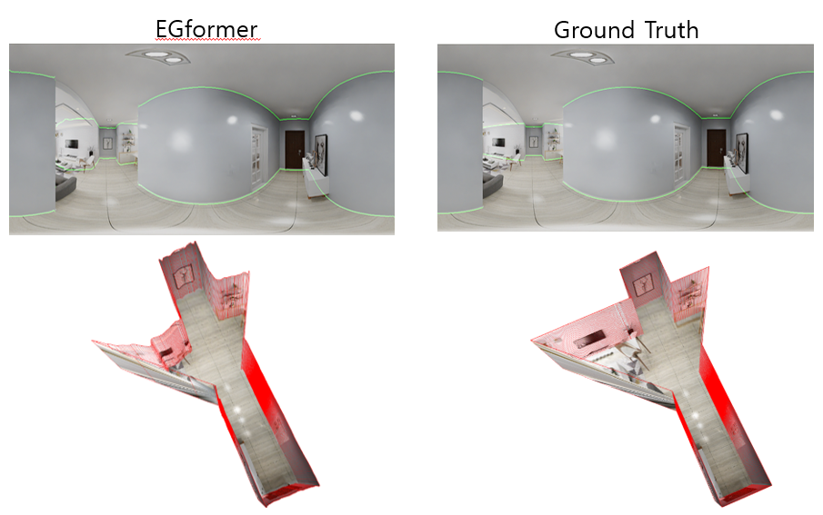

# Layout estimation
For the users who want to test layout etstimation under our experimental setup, we provide sample codes based on the [HorizonNet](https://github.com/sunset1995/HorizonNet) annotation.

🔔 NOTE: The purpose of this repo is just to show an example of applying layout estimation codes under our experimental setup. Therefore, before using these codes for your experiments, you need to check codes carefully whether there exist errors which may impair performances. 

🔔 NOTE: To make output format as similar to HorizonNet anootation, we modify the output layer of EGformer/Panoformer.

## 1. Setup
#### 1) Prepare Structure3D dataset by following the instructions in depth estimation repo. 

Check whether there exists layout.txt file as below. 

```bash
├── Structure3D
   ├── scene_n
        ├── 2D_rendering
            ├── room_number
                ├── panorama
                    ├── layout.txt
                    ├── full
                        ├── rgb_rawlight.png
                        ├── depth.png
                 

``` 
#### 2) Prepare depth pretrained models by follwing the instructions in depth estimation repo. 
We utilize depth pre-trained models to initizliae the convolution weight parameters when training each model

## 2. Training

#### 1) Run the scripts in 'train_scripts' folder to train EGformer/Panoformer for layout estimation


To train EGformer, do 

~~~bash
bash train_scripts/script_EGformer
~~~

We utilize depth pre-trained models to initizliae the convolution weight parameters.

## 3.  Evaluation

####  1) Go to evaluate folder & run the script
Go to evalute folder & run the script in `eval_script` after the training is done.  

~~~bash
cd evaluate
bash scripts/eval_script
~~~

When we train EGformer\Panopformer using scripts in 'train_scripts' above, we get results below.
For details about evaluation metrics, refer to HorizonNet.

| Model               | # Corners | 2D IoU | 3D IoU | | Model               | # Corners | 2D IoU | 3D IoU |
|---------------------|--------------------------|---|-----------------------|-----------------|---------------------|--------------------------|--------------------------|-----------------|  
| EGformer     | 4 | 92.84 | 91.02| |Panoformer | 4 | 90.25 | 88.09|
| EGformer     | 6 | 89.12 | 87.47| |Panoformer | 6 | 86.73 | 84.95|
| EGformer     | 8 | 87.35 | 85.52| |Panoformer | 8 | 85.70 | 83.99|
| EGformer     | 10+ | 80.79 | 79.37| |Panoformer | 10+ | 77.15 | 75.45|
| EGformer     | Overall | 90.34 | 88.62| |Panoformer | Overall | 87.72 | 85.71|



